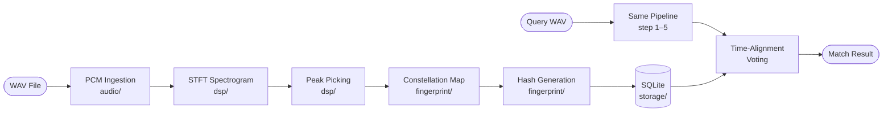
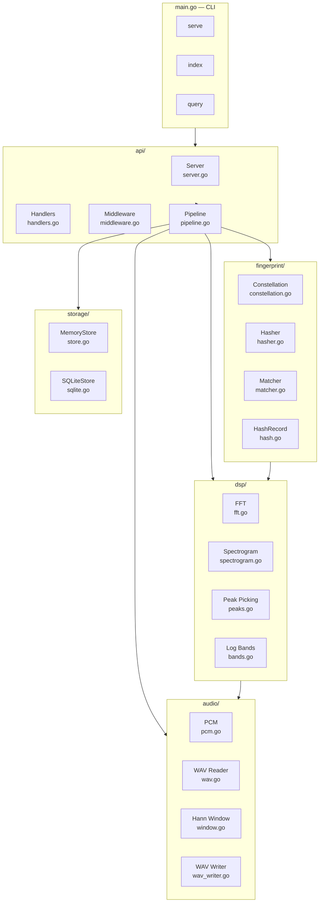

# audiofp — Audio Fingerprinting Engine

> A Shazam-inspired audio fingerprinting system built from scratch in Go, as a research project to understand exactly how acoustic identification works under the hood — from raw PCM samples to a matched song in under 100ms.

---

## Why I Built This

I've always been curious about the black box behind "hold your phone up and it knows the song." The Shazam algorithm was published in a 2003 paper by Avery Wang and it is genuinely elegant — but most explanations stop at "it uses fingerprints," which tells you nothing useful. I wanted to build the thing myself, step by step, to understand every DSP decision: why FFT and not some other transform, why a constellation map and not the full spectrogram, why time-offset hashing enables matching a 10-second clip anywhere in a 5-minute song.

This is a research implementation. It is not a production system. Every design decision is documented with its reasoning, every parameter is tunable, and every package has a test suite. The goal is to have a codebase you can read alongside the theory and have both make sense.

---

## What It Does

Given a library of songs (WAV files) and an unknown audio clip (also WAV), the engine:

1. **Indexes** each song: computes its spectrogram, extracts prominent frequency peaks, builds a sparse constellation map, generates thousands of position-invariant hash pairs, and stores them in a SQLite database.

2. **Identifies** an unknown clip in under 100ms: runs the same pipeline on the query, looks up its hashes in the database, and uses time-alignment voting to find which song — and at which position in that song — the clip came from.

```
$ audiofp index --db library.db --name "Song A" song_a.wav
Indexed: "Song A"  song_id=1  peaks=206  hashes=1011  (65ms)

$ audiofp query --db library.db clip.wav
Match: "Song A"  song_id=1  confidence=19.0%  votes=428  align=0  (32ms)
```

---

## The Full Pipeline

The pipeline is a six-stage signal processing chain. Understanding each stage is the point of this project.



---

### Stage 1 — Audio Ingestion (`audio/`)

The engine reads WAV files and converts them to a normalized mono `float64` signal in `[-1.0, 1.0]`. Stereo is downmixed by averaging L+R channels.

Supported bit depths: **8-bit unsigned**, **16-bit signed** (most common), **32-bit signed**.

The RIFF/WAV parser handles chunked files in any order — it scans forward past unknown metadata chunks (LIST, smpl, INFO) until it finds the `fmt` and `data` sub-chunks. The WAV encoder (`EncodeWAV`) writes to any `io.Writer`, so it works equally for disk files and HTTP response bodies.

---

### Stage 2 — STFT Spectrogram (`dsp/`)

A **Short-Time Fourier Transform** converts the time-domain signal into a two-dimensional time-frequency map. This is the foundation everything else builds on.

**Why FFT and not something else?**

The FFT computes the DFT in **O(N log N)** instead of O(N²) by recursively splitting the N-point transform into two N/2-point transforms (Cooley-Tukey). For N=4096 that's roughly 50× faster than a naive DFT. The implementation here is a standard radix-2 Decimation-In-Time butterfly.

**STFT parameters:**

| Parameter | Value | What it means |
|---|---|---|
| FFT size | 4096 samples | ~93ms per frame at 44100 Hz |
| Hop size | 2048 samples | 50% overlap between frames |
| Window | Hann | Eliminates spectral leakage at frame boundaries |
| Frequency resolution | ~10.77 Hz/bin | `44100 / 4096` |
| Bins per frame | 2049 | Positive half of the FFT output |

**Why the Hann window?**

Slicing a continuous signal into frames creates sharp edges — abrupt cut-on and cut-off points. These edges introduce artificial high-frequency content (spectral leakage) that would produce false peaks. The Hann window tapers each frame smoothly to zero at both ends, eliminating the discontinuity. The trade-off is a slightly wider main lobe, which is acceptable here because we need robust peaks, not maximum spectral precision.

**What the spectrogram looks like** for a 440 + 554 + 659 Hz chord held for 5 seconds:

```
Freq (Hz)
  880 │·············░░░░░░░░░░░░░░░░░░░░░░░░···············│
  659 │·········▓▓▓▓▓▓▓▓▓▓▓▓▓▓▓▓▓▓▓▓▓▓▓▓▓▓▓▓▓▓▓▓▓▓········│
  554 │·········▓▓▓▓▓▓▓▓▓▓▓▓▓▓▓▓▓▓▓▓▓▓▓▓▓▓▓▓▓▓▓▓▓▓········│
  440 │·········█████████████████████████████████████······│
  330 │··················································│
  220 │··················································│
  110 │··················································│
      └──────────────────────────────────────────────────→
      0        1        2        3        4       5 sec

  Legend:  █ high energy   ▓ medium   ░ low   · silence
```

Each vertical slice is one FFT frame. The horizontal bands are the three chord tones. The spectrogram has `~106 frames × 2049 bins` for 5 seconds of audio.

---

### Stage 3 — Peak Picking (`dsp/`)

The full spectrogram has ~217,000 values per second of audio — far too many to hash or compare. Peak picking reduces it to a sparse set of **locally prominent points** that are stable under noise, EQ changes, and volume shifts.

**Algorithm:**

1. Convert each frame's linear magnitude to **dB scale** (`20 × log10(magnitude)`), compressing 1000:1 amplitude ratios into a ~60 dB range.
2. Compute a per-frame **adaptive noise floor** (median dB of the frame). A candidate must exceed `floor + 10 dB`.
3. Test each bin as a **2D local maximum** in a `±2 frames × ±5 bins` neighborhood.
4. Apply **log-frequency band quotas**: divide 200–10000 Hz into 6 logarithmic bands, keep at most 5 peaks per band per frame. This forces spectral diversity — peaks don't all cluster in the dominant frequency range.

**Why adaptive thresholding?**

A fixed dB threshold fails on quiet recordings (too few peaks) and loud recordings (too many peaks). Measuring the floor per-frame with the median makes the threshold signal-relative: it rises in loud sections and falls in quiet ones, keeping peak density roughly constant regardless of recording level.

**Why log-frequency bands?**

Without banding, ~80% of peaks cluster in the 1–5 kHz range where music has the most energy and linear FFT bins are densest. A 196 Hz bass note and a 9 kHz hi-hat would both be invisible. Log bands force the algorithm to find the best peaks in each perceptual octave.

**The 6 log bands** (200–10000 Hz at 44100 Hz, FFT 4096):

```
Band 0  │  200 –  419 Hz  │  bins   19 –  39  │  sub-bass / bass
Band 1  │  419 –  878 Hz  │  bins   39 –  81  │  low-mid
Band 2  │  878 – 1840 Hz  │  bins   81 – 170  │  mid
Band 3  │ 1840 – 3855 Hz  │  bins  170 – 357  │  upper-mid
Band 4  │ 3855 – 8077 Hz  │  bins  357 – 748  │  presence / air
Band 5  │ 8077 –10000 Hz  │  bins  748 – 926  │  brilliance
```

---

### Stage 4 — Constellation Map (`fingerprint/`)

The constellation map is a set of `(TimeFrame, FreqBin)` points — the spectral peaks with magnitude discarded.

**What it looks like** (same A-major chord, peaks only):

```
Freq
  ↑
  880│              *                  *         *
  659│     *              *    *            *
  554│           *                *               *
  440│  *    *        *       *        *       *
  220│
  110│
     └──────────────────────────────────────────────→ Time (frames)
        0    5   10   15   20   25   30   35   40

  * = spectral peak landmark
```

**Why this is robust:**

- **Volume invariant**: magnitude is discarded. A quiet recording matches a loud one.
- **Phase invariant**: we only store position, not phase.
- **Noise tolerant**: local maxima persist under mild additive noise because dominant peaks are tens of dB above the noise floor.
- **EQ tolerant**: mild spectral tilt doesn't move the peak *positions* significantly, only their magnitudes.

A 5-second chord produces roughly **200 constellation points** — a ~1000× reduction from the full spectrogram.

---

### Stage 5 — Hash Generation (`fingerprint/`)

This is where the algorithm becomes **position-invariant** — able to match a clip regardless of where in the song it starts.

For each **anchor** point `A`, the algorithm fans out to up to 5 **target** points `T` within a 100-frame lookahead window and encodes:

```
Hash = pack(A.FreqBin, T.FreqBin, T.TimeFrame − A.TimeFrame)
```

Stored alongside the hash is the **anchor's absolute time** in the reference recording.

**Bit layout of the uint32 hash:**

```
  Bit 31                              Bit 0
  ┌──────────────┬──────────────┬──────────────┐
  │  anchor bin  │  target bin  │  delta time  │
  │   10 bits    │   10 bits    │   12 bits    │
  │  (0 – 1023)  │  (0 – 1023)  │ (0 – 4095 f) │
  └──────────────┴──────────────┴──────────────┘
```

**Why not just hash single peaks?**

A single frequency tells you almost nothing distinctive. "There was a 440 Hz peak at some point" describes thousands of songs. The *relationship* between two peaks — "440 Hz followed by 659 Hz exactly 23 frames later" — is far more specific. Multiple overlapping pair relationships form a web that uniquely identifies a musical moment.

**Why no absolute time in the hash?**

The hash encodes only the *time difference* between anchor and target, not their absolute positions. This makes the hash **position-invariant**: the same musical phrase at second 10 or second 60 produces identical hashes. Position information is recovered during matching via the stored `TimeOffset`.

**Fan-out pairing diagram:**

```
Constellation (time-ordered)
                                          FanOutWindow = 100 frames
  A (anchor) ──────────────────────────────────────┐
      │                                             │
      ├──→ T1  (delta=3)  → hash(A.freq, T1.freq, 3)│
      ├──→ T2  (delta=7)  → hash(A.freq, T2.freq, 7)│
      ├──→ T3  (delta=12) → hash(A.freq, T3.freq,12)│
      ├──→ T4  (delta=18) → hash(A.freq, T4.freq,18)│
      └──→ T5  (delta=25) → hash(A.freq, T5.freq,25)│
                                                     │
  max 5 targets per anchor ────────────────────────-─┘
```

A 5-second song generates roughly **1000 hashes**, each stored as `(hash → song_id, anchor_time_offset)` in the database.

---

### Stage 6 — Time-Alignment Voting (`fingerprint/`)

Matching is a **voting problem**, not a similarity search.

For each hash `H` generated from the query (with anchor at `queryOffset`):
- Look up all database postings matching `H`: `(song_id, refOffset)`
- Compute `alignment = refOffset − queryOffset`
- Vote: `votes[song_id][alignment]++`

If the query clip is genuinely from song S at position P, then *every* matching hash will produce `alignment ≈ P`. Those votes stack up into a spike. Random collisions from other songs scatter across all alignments — they're noise.

**The alignment histogram for a correct match:**

```
Votes
  ↑
 50│                    ██
 40│                   ████
 30│                  ██████
 20│    █   ░░  █    ████████   ░  █░   ░
 10│  ░░███░░░░███░░░██████████░░░████░░░██░
    └────────────────────────────────────────→ Alignment offset (frames)
                         ↑
               Winner (428 votes, 19% confidence)
               = Song A, starting at frame 0
```

The winning `(song_id, alignment)` pair with the most votes is the match. Confidence = `winner_votes / total_hits`.

**Why this works on partial clips:**

If you query with seconds 2–5 of a song (instead of the full recording), the alignment value shifts by the clip's start position — but it's still a single consistent value across all matching hashes. The spike is still there, just at a different offset.

---

## Architecture



**Import rules (no cycles):**

```
api  →  fingerprint  →  dsp  →  audio
api  →  storage
fingerprint/matcher  →  storage
storage  →  (stdlib only)
```

---

## Repository Structure

```
audiofp/
├── main.go                    CLI entry point (serve / index / query)
│
├── audio/                     Raw audio I/O and preprocessing
│   ├── pcm.go                 PCM type, mono downmix, normalization
│   ├── window.go              Hann window function
│   ├── wav.go                 RIFF/WAV chunked parser (read)
│   └── wav_writer.go          WAV encoder (io.Writer-based)
│
├── dsp/                       Digital signal processing
│   ├── fft.go                 Cooley-Tukey radix-2 DIT FFT
│   ├── spectrogram.go         STFT: frame slicing → window → FFT → magnitude
│   ├── peaks.go               2D local-maximum peak picking, adaptive threshold
│   └── bands.go               Logarithmic frequency band partitioning
│
├── fingerprint/               Fingerprint construction and matching
│   ├── constellation.go       Sparse landmark map (TimeFrame, FreqBin)
│   ├── hash.go                HashRecord type, uint32 bit-packing
│   ├── hasher.go              Fan-out anchor→target pairing
│   └── matcher.go             Time-alignment voting, MatchResult
│
├── storage/                   Persistence layer
│   ├── store.go               Store interface + MemoryStore
│   └── sqlite.go              SQLiteStore with WAL mode and hash index
│
├── api/                       HTTP API
│   ├── server.go              Server, route table, graceful shutdown
│   ├── handlers.go            POST /songs, POST /query, GET /songs, GET /health
│   ├── middleware.go          requestID, logger, recovery, maxBodySize
│   ├── pipeline.go            DSP pipeline wrapper (Index, Query)
│   └── response.go            JSON envelope helpers
│
└── go.mod
```

---

## Prerequisites

| Requirement | Version | Notes |
|---|---|---|
| Go | 1.22+ | `go version` |
| GCC | any recent | Required for CGO SQLite driver |
| Ubuntu/Debian | — | `sudo apt install build-essential` |
| macOS | — | `xcode-select --install` |
| Windows | — | [tdm-gcc](https://jmeubank.github.io/tdm-gcc/) or WSL2 |

---

## Installation

```bash
# Clone the repository
git clone https://github.com/cheemney/audiofp
cd audiofp

# Download dependencies (go-sqlite3 fetches from github.com)
GONOSUMDB="*" go mod download

# Build the binary
CGO_ENABLED=1 go build -o audiofp .

# Verify
./audiofp
```

---

## Running Tests

```bash
# Full test suite with race detector (recommended)
CGO_ENABLED=1 go test ./... -race

# Verbose output showing each test name
CGO_ENABLED=1 go test ./... -v

# Single package
CGO_ENABLED=1 go test ./dsp/... -v
CGO_ENABLED=1 go test ./fingerprint/... -v
CGO_ENABLED=1 go test ./api/... -v

# With coverage report
CGO_ENABLED=1 go test ./... -cover
```

**Current test coverage: 87 tests across 5 packages — all passing.**

| Package | Tests | What's covered |
|---|---|---|
| `audio` | 7 | WAV round-trip, sample rates, clipping, error cases |
| `dsp` | 22 | FFT correctness (DC, single tone, power-of-two), spectrogram frame count and tone localization, log band partitioning, peak picking quota and ordering |
| `fingerprint` | 30 | Hash packing round-trips, clamping, fan-out constraints, constellation helpers, self-match, partial-clip match, alignment recovery, wrong-song rejection |
| `storage` | 14 | MemoryStore and SQLiteStore CRUD, persistence, uint32 boundary values, concurrent access |
| `api` | 14 | All HTTP endpoints: correct responses, error codes (400/404/405/409), multipart parsing, end-to-end index→query |

---

## CLI Reference

### `serve` — Start the HTTP server

```bash
audiofp serve [--port PORT] [--db PATH]

# Defaults
audiofp serve --port 8080 --db fingerprints.db

# Custom
audiofp serve --port 9000 --db /data/library.db
```

Starts the HTTP API. Blocks until `SIGINT` or `SIGTERM`, then gracefully drains in-flight requests (10-second window) before exiting.

---

### `index` — Fingerprint and store a WAV file

```bash
audiofp index [--db PATH] [--name "Song Name"] audio.wav

# Song name defaults to the filename without extension
audiofp index --db library.db --name "Pink Floyd - Time" time.wav
audiofp index --db library.db unknown_recording.wav
```

**Output:**
```
Indexed: "Pink Floyd - Time"  song_id=3  peaks=198  hashes=954  (67ms)
```

---

### `query` — Identify an unknown WAV clip

```bash
audiofp query [--db PATH] audio.wav

audiofp query --db library.db snippet.wav
```

**Output on match:**
```
Match: "Pink Floyd - Time"  song_id=3  confidence=17.2%  votes=412  align=43  (35ms)
```

**Output on no match (exit code 2):**
```
No match found (28ms)
```

The `align` value is the frame offset into the reference recording where the clip was found. Multiply by `HopSize / SampleRate` (= `2048 / 44100 ≈ 0.046s`) to get seconds.

---

## HTTP API Reference

### `GET /health`

Liveness probe.

```bash
curl http://localhost:8080/health
```

```json
{
  "ok": true,
  "data": { "status": "ok", "version": "step5" }
}
```

---

### `GET /songs`

Returns store statistics.

```bash
curl http://localhost:8080/songs
```

```json
{
  "ok": true,
  "data": {
    "stats": {
      "songs": 3,
      "hash_entries": 2847,
      "total_postings": 2961
    }
  }
}
```

---

### `POST /songs` — Index a song

Upload a WAV file to fingerprint and store it.

```bash
curl -F file=@song.wav -F name="Song Name" http://localhost:8080/songs
```

**Success (201 Created):**
```json
{
  "ok": true,
  "data": {
    "song_id": 1,
    "name": "Song Name",
    "peaks": 206,
    "hashes": 1011
  }
}
```

**Errors:**
| Code | Reason |
|---|---|
| 400 | Missing `file` field, or file is not a valid WAV |
| 409 | A song with that name is already indexed |
| 413 | File exceeds the 50 MB upload limit |
| 500 | Internal server error |

---

### `POST /query` — Identify an unknown clip

Upload a WAV clip to match against the indexed library.

```bash
curl -F file=@clip.wav http://localhost:8080/query
```

**Match found (200 OK):**
```json
{
  "ok": true,
  "data": {
    "song_id": 1,
    "name": "Song Name",
    "votes": 428,
    "confidence": 0.19,
    "alignment_frames": 0
  }
}
```

**No match (404 Not Found):**
```json
{
  "ok": false,
  "error": "no match found"
}
```

**All responses share the same envelope:**
```
{ "ok": bool, "data": {...}, "error": "..." }
```

Every response also carries `X-Request-ID` for log correlation.

---

## DSP Configuration

All parameters live in `api/pipeline.go` (for the HTTP API) and can be tuned for different use cases.

### Spectrogram

```go
dsp.SpectrogramConfig{
    FFTSize: 4096,  // samples per frame (must be power of 2)
    HopSize: 2048,  // step between frames (50% overlap)
}
```

| Increase FFTSize | Better frequency resolution, worse time resolution |
| Decrease FFTSize | Better time resolution, worse frequency resolution |
| Decrease HopSize | Denser frames, more peaks, larger index |

### Peak Picking

```go
dsp.PeakConfig{
    TimeNeighborhood:     2,    // ±frames for local max test
    FreqNeighborhood:     5,    // ±bins for local max test
    PeaksPerBandPerFrame: 5,    // quota per log band per frame
    MinDBAboveFloor:      10.0, // dB above per-frame median
}
```

### Hash Generation

```go
fingerprint.HasherConfig{
    FanOutWindow:        100, // max delta-time in frames (~4.6s)
    MaxTargetsPerAnchor: 5,   // max pairings per anchor point
}
```

### Matching

```go
fingerprint.MatchConfig{
    MinVotes:      5,    // minimum aligned votes to declare a match
    MinConfidence: 0.01, // minimum votes/totalHits ratio
}
```

---

## SQLite Schema

```sql
CREATE TABLE songs (
    id   INTEGER PRIMARY KEY AUTOINCREMENT,
    name TEXT UNIQUE NOT NULL
);

CREATE TABLE fingerprints (
    hash        INTEGER NOT NULL,  -- uint32 packed as int64
    song_id     INTEGER NOT NULL,
    time_offset INTEGER NOT NULL   -- anchor frame in reference recording
);

-- Critical for O(log N) lookup performance
CREATE INDEX idx_fp_hash ON fingerprints(hash);
```

WAL mode is enabled for concurrent read/write: `PRAGMA journal_mode = WAL`.

---

## Measured Performance

Numbers from a synthetic 4-chord library on an ordinary laptop:

| Operation | Audio | Time |
|---|---|---|
| Index | 7-second WAV (4 chord tones) | ~65ms |
| Query | 3-second clip | ~32ms |
| Hashes per song | ~7s song | ~1000 hashes |
| Peaks per song | ~7s song | ~150–200 peaks |
| DB size | 3 songs | ~24 KB |

---

## Known Limitations

| Limitation | Detail |
|---|---|
| WAV only | No MP3, FLAC, or AAC support. Workaround: `ffmpeg -i input.mp3 -f wav pipe:1` |
| 44100 Hz assumed | The peak config is tuned for 44100 Hz. Other sample rates produce different bin mappings. |
| No resampling | Phone recordings at 8/16/48 kHz must be resampled before indexing. |
| Pure sine tones are ambiguous | A monotone signal has identical hashes every frame — all alignments get equal votes. This is expected and documented. Real polyphonic audio works correctly. |
| No authentication | The HTTP API has no auth. Add an API key middleware to `chain()` in `server.go`. |
| `GET /songs` returns stats only | No paginated song listing. A `SELECT id, name FROM songs` query is the missing piece. |

---

## References

- Wang, A. (2003). **An Industrial-Strength Audio Search Algorithm**. *Proceedings of the 4th International Symposium on Music Information Retrieval (ISMIR)*. The original Shazam paper.
- Cooley, J.W. & Tukey, J.W. (1965). **An algorithm for the machine calculation of complex Fourier series**. *Mathematics of Computation, 19*(90), 297–301.
- Harris, F.J. (1978). **On the use of windows for harmonic analysis with the discrete Fourier transform**. *Proceedings of the IEEE, 66*(1), 51–83. (The case for Hann windowing.)
- SQLite WAL documentation: https://sqlite.org/wal.html

---

## License

[MIT](LICENSE)
